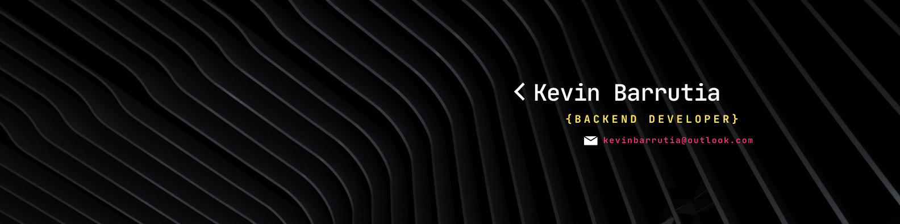

============================================================================================
# Hi there 👋 I'm Kevin Barrutia, a passionate Backend development and tech-lover.
-----------------

🚀 Técnico egresado de la carrera de Desarrollo de Sistemas de Información en el Instituto de Educación Superior Tecnológico IDAT. 

🛠️ Durante mi formación, adquirí un profundo conocimiento en programación y desarrollo de aplicaciones web, con un enfoque en tecnologías backend como Java, Spring, y bases de datos relacionales (MySQL). 

🧠 Mi experiencia académica me permitió dominar la implementación de sistemas escalables, el uso de metodologías ágiles (Scrum) para la gestión de proyectos, y el manejo de herramientas modernas de desarrollo como Maven y Swagger para la documentación de APIs.

* 🌍  I'm based in Lima - Perú
* ✉️  You can contact me at [kevinbarrutia@outlook.com](mailto:kevinbarrutia@outlook.com)
* 🧠  I'm learning Backend Development | IT Support | Cybersecurity
* 🤝  I'm open to collaborating on Backend web development

### Skills

### Socials

 <a href="https://www.github.com/KevinBarrutia" target="_blank" rel="noreferrer"> <picture> <source media="(prefers-color-scheme: dark)" srcset="https://raw.githubusercontent.com/danielcranney/readme-generator/main/public/icons/socials/github-dark.svg" /> <source media="(prefers-color-scheme: light)" srcset="https://raw.githubusercontent.com/danielcranney/readme-generator/main/public/icons/socials/github.svg" />  </picture> </a> <a href="https://www.linkedin.com/in/kevin-barrutia-1a42a01aa/" target="_blank" rel="noreferrer"> <picture> <source media="(prefers-color-scheme: dark)" srcset="https://raw.githubusercontent.com/danielcranney/readme-generator/main/public/icons/socials/linkedin-dark.svg" /> <source media="(prefers-color-scheme: light)" srcset="https://raw.githubusercontent.com/danielcranney/readme-generator/main/public/icons/socials/linkedin.svg" />  </picture> </a>

### Badges

<b>My GitHub Stats</b>

